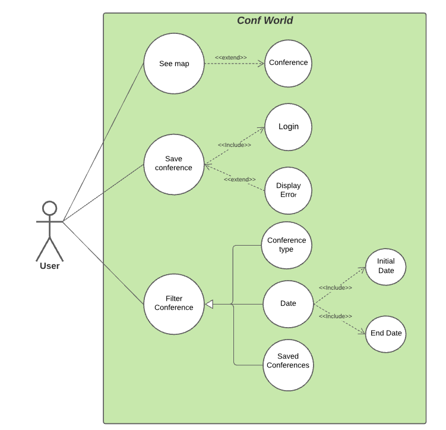

# Conf World

Welcome to the documentation pages of the *Conf World* of **openCX**!

You can find here detailed about the (sub)product, hereby mentioned as module, from a high-level vision to low-level implementation decisions, a kind of Software Development Report (see [template](https://github.com/softeng-feup/open-cx/blob/master/docs/templates/Development-Report.md)), organized by discipline (as of RUP): 

* Business modeling 
  * [Product Vision](#Product-Vision)
  * [Elevator Pitch](#Elevator-Pitch)
* Requirements
  * [Use Case Diagram](#Use-case-diagram)
  * [User stories](#User-stories)
  * [Domain model](#Domain-model)
* Architecture and Design
  * [Logical architecture](#Logical-architecture)
  * [Physical architecture](#Physical-architecture)
  * [Prototype](#Prototype)
* [Implementation](#Implementation)
* [Test](#Test)
* [Configuration and change management](#Configuration-and-change-management)
* [Project management](#Project-management)

So far, contributions are exclusively made by the initial team, but we hope to open them to the community, in all areas and topics: requirements, technologies, development, experimentation, testing, etc.

Please contact us! 

Thank you!

*Bernardo António Magalhães Ferreira*
*Diogo Ferreira de Sousa*
*Diogo Samuel Gonçalves Fernandes*
*Hugo Miguel Monteiro Guimarães*

---

## Product Vision

Finding a conference to attend and all its relevant information can be difficult to do in a fast, easy way. Conf World allows you to find the conferences you want that fit right into your schedule.

---
## Elevator Pitch

Most conferences suffer from a common problem. They have not only a final *rendezvous* date, but also many paper submission deadlines, making it difficult to analyze if the conference can fit the user's tight schedule. ***Conf World*** is a mobile app capable of filtering conferences based upon a time interval and conferences types, allowing the user to completely bypass this issue. 

> O stor sugeriu ~800 carateres, está bem assim?

---
## Requirements

In this section, you should describe all kinds of requirements for your module: functional and non-functional requirements.

Start by contextualizing your module, describing the main concepts, terms, roles, scope and boundaries of the application domain addressed by the project.

### Use Case Diagram 

#### Save Conference
* **Actor**. User

* **Description**. The user may be more interested in some conferences than others. Thus he is capable of saving conferences.

* **Preconditions and Postconditions**. Before saving conferences the user should be logged in. After saving the conference, it will appear in the map with a yellow pinpoint.

* **Normal Flow**. 
    1. The user presses one conference on the map.
    2. The user presses the save conference button which appears next to the conference website hyperlink.
    3. If the user is logged in, the conference is saved.

* **Exception**. 
    1. The user presses one conference on the map
    2. The user presses the save conference button which appears next to the conference website hyperlink.
    3. The user isn't logged in, an error message will appear

#### See Map
* **Actor**. User

* **Description**. This use case exists so that the client can see where conferences are located.

* **Preconditions and Postconditions**. The client should press the Open Map button at the main menu. After pressing it, the app will show the global map with many pinpoints, each one representing one conference.

* **Normal Flow**. 
    1. The client presses the  *Open Map* button to open the world map.
    2. Now the user can search around the world for conferences
    3. When the user finds the desired conference (marked on the map with a pinpoint), the user can press it and view its information
    4. The user can click on the conference hyperlink to go to its website.  

#### Filter conference 
* **Actor**. User

* **Description**. The user can filter the conferences in order that only relevant ones appear. The user can filter them using the follow criteria.

* **Postconditions**. After using the filter, only certain conferences around the world will appear.

    ##### Conference Type

    * **Preconditions**.

    * **Normal Flow**.
        1. The user selects the option that shows the conference types.
        2. On the map, only conferences occurring between these two dates will appear.
            
    ##### Date

    * **Preconditions**. Before filtering by date, the user should press the button to filter conferences.
    
    * **Normal Flow**. 
        1. The user scrolls the sidebar, selecting the start and deadline date.
        2. On the map, only conferences that occur between these two dates will appear. 
        
    ##### Saved Conferences

    * **Preconditions**. Before filtering by saved conferences the user should be logged in and have at least one saved conference.

    * **Normal Flow**.
        1. The user selects the option to only show the saved conferences.
        1. If the user is logged in, only the saved conferences will appear on the map.

    * **Exception Flow**. 
        1. The user selects the option to only show the saved conferences.
        3. If the user isn't logged in or doesn't have any saved conference, nothing will happen.

### User stories
This section will contain the requirements of the product described as **user stories**, organized in a global **[user story map](https://plan.io/blog/user-story-mapping/)** with **user roles** or **themes**.

For each theme, or role, you may add a small description. User stories should be detailed in the tool you decided to use for project management (e.g. trello or github projects).

A user story is a description of desired functionality told from the perspective of the user or customer. A starting template for the description of a user story is 

*As a < user role >, I want < goal > so that < reason >.*


**INVEST in good user stories**. 
You may add more details after, but the shorter and complete, the better. In order to decide if the user story is good, please follow the [INVEST guidelines](https://xp123.com/articles/invest-in-good-stories-and-smart-tasks/).

**User interface mockups**.
After the user story text, you should add a draft of the corresponding user interfaces, a simple mockup or draft, if applicable.

**Acceptance tests**.
For each user story you should write also the acceptance tests (textually in Gherkin), i.e., a description of scenarios (situations) that will help to confirm that the system satisfies the requirements addressed by the user story.

**Value and effort**.
At the end, it is good to add a rough indication of the value of the user story to the customers (e.g. [MoSCoW](https://en.wikipedia.org/wiki/MoSCoW_method) method) and the team should add an estimation of the effort to implement it, for example, using t-shirt sizes (XS, S, M, L, XL).


**Story #1**

*As a user, I want to open up the map, so that I can see all the available conferences next to me.*

**User interface mockups**.
*Wow, such empty*

**Acceptance tests**.
```gherkin
Scenario:
  Given There is a View Map button
  When I tap the View Map button
  Then The world map will open
  And I will see all conferences represented by pinpoints
```

**Value and effort**.
*Wow, such empty*


**Story #2**

*As a user, I want to save a conference I wish to attend, so that I can mark it(save) on the map for easy access.*

**User interface mockups**.
*Wow, such empty*

**Acceptance tests**.
```gherkin
Scenario:
  Given I have selected a conference on the Map
  And I am Logged In.
  When I tap the save conference button.
  Then The app will save my conference
  And I will be able to access it in the saved menu.
```

```gherkin
Scenario:
  Given I have selected a conference on the Map
  And I am not Logged In.
  When I tap the save conference button.
  Then The app will ask me to Log In
  And I will be able to save the conference if the login is successful.
```

**Value and effort**.
*Wow, such empty*


**Story #3**

*As a user, I want to access a conference’s details, so that I can see the available information about it.*

**User interface mockups**.
*Wow, such empty*

**Acceptance tests**.
```gherkin
Scenario:
  Given I have the conference pinpoint on my screen
  When I tap a conference's pinpoint.
  Then The app will redirect me to the conference's website.
  And I will be able to see all the information about it.
```

**Value and effort**.
*Wow, such empty*

**Story #4**

*As a user I want to select a timespan, so that I can see all available conferences in that timespan.*

**User interface mockups**.
*Wow, such empty*

**Acceptance tests**.
```gherkin
Scenario:
  Given I am in the Filter Conference Menu
  When I tap the Date button.
  And Enter a timespan
  Then The app will show me all conferences that occurr within that timespawn
```

**Value and effort**.
*Wow, such empty*

**Story #5**
*As a user, I want to search for conferences that match my interests, so that I can better find what I'm looking for.*

**User interface mockups**.
*Wow, such empty*

**Acceptance tests**.
```gherkin
Scenario:
  Given I am on the Filtering Menu.
  When I tap the search button.
  And I write the conference name.
  Then The world map will open centered on the conference pinpoint.
  And I will be able to select the conference.
```
```gherkin
Scenario:
  Given I am on the Filtering Menu.
  When I tap the Type button.
  And I select a conference type.
  Then The world map will only show pinpoints with conferences regarding the selected type.
  And I will be able to select the conference.
```
```gherkin
Scenario:
  Given I am on the Filtering Menu.
  When I tap the Saved Conferencees button.
  Then The world map will only show pinpoints with saved conferences
  And I will be able to select the conference.
```

**Value and effort**.
*Wow, such empty*

**Story #6**

*As a user, I want to log in, so that I can access my saved conferences.*

**User interface mockups**.
*Wow, such empty*

**Acceptance tests**.
```gherkin
Scenario:
  Given I am in the Main Menu
  And I am not Logged In yet.
  When I tap the Login button.
  And Enter my credentials
  Then The app will log me into my account
  And I will be able to access my saved conferences.
```

**Value and effort**.
*Wow, such empty*


### Domain model

To better understand the context of the software system, it is very useful to have a simple UML class diagram with all the key concepts (names, attributes) and relationships involved of the problem domain addressed by your module.

---

## Architecture and Design
The architecture of a software system encompasses the set of key decisions about its overall organization. 

A well written architecture document is brief but reduces the amount of time it takes new programmers to a project to understand the code to feel able to make modifications and enhancements.

To document the architecture requires describing the decomposition of the system in their parts (high-level components) and the key behaviors and collaborations between them. 

In this section you should start by briefly describing the overall components of the project and their interrelations. You should also describe how you solved typical problems you may have encountered, pointing to well-known architectural and design patterns, if applicable.

### Logical architecture
The purpose of this subsection is to document the high-level logical structure of the code, using a UML diagram with logical packages, without the worry of allocating to components, processes or machines.

It can be beneficial to present the system both in a horizontal or vertical decomposition:
* horizontal decomposition may define layers and implementation concepts, such as the user interface, business logic and concepts; 
* vertical decomposition can define a hierarchy of subsystems that cover all layers of implementation.

### Physical architecture
The goal of this subsection is to document the high-level physical structure of the software system (machines, connections, software components installed, and their dependencies) using UML deployment diagrams or component diagrams (separate or integrated), showing the physical structure of the system.

It should describe also the technologies considered and justify the selections made. Examples of technologies relevant for openCX are, for example, frameworks for mobile applications (Flutter vs ReactNative vs ...), languages to program with microbit, and communication with things (beacons, sensors, etc.).

### Prototype
To help on validating all the architectural, design and technological decisions made, we usually implement a vertical prototype, a thin vertical slice of the system.

In this subsection please describe in more detail which, and how, user(s) story(ies) were implemented.

---

## Implementation
Regular product increments are a good practice of product management. 

While not necessary, sometimes it might be useful to explain a few aspects of the code that have the greatest potential to confuse software engineers about how it works. Since the code should speak by itself, try to keep this section as short and simple as possible.

Use cross-links to the code repository and only embed real fragments of code when strictly needed, since they tend to become outdated very soon.

---
## Test

There are several ways of documenting testing activities, and quality assurance in general, being the most common: a strategy, a plan, test case specifications, and test checklists.

In this section it is only expected to include the following:
* test plan describing the list of features to be tested and the testing methods and tools;
* test case specifications to verify the functionalities, using unit tests and acceptance tests.
 
A good practice is to simplify this, avoiding repetitions, and automating the testing actions as much as possible.

---
## Configuration and change management

Configuration and change management are key activities to control change to, and maintain the integrity of, a project’s artifacts (code, models, documents).

For the purpose of ESOF, we will use a very simple approach, just to manage feature requests, bug fixes, and improvements, using GitHub issues and following the [GitHub flow](https://guides.github.com/introduction/flow/).


---

## Project management

Software project management is an art and science of planning and leading software projects, in which software projects are planned, implemented, monitored and controlled.

In the context of ESOF, we expect that each team adopts a project management tool capable of registering tasks, assign tasks to people, add estimations to tasks, monitor tasks progress, and therefore being able to track their projects.

Example of tools to do this are:
  * [Trello.com](https://trello.com)
  * [Github Projects](https://github.com/features/project-management/com)
  * [Pivotal Tracker](https://www.pivotaltracker.com)
  * [Jira](https://www.atlassian.com/software/jira)

We recommend to use the simplest tool that can possibly work for the team.


---

## Evolution - contributions to open-cx

Describe your contribution to open-cx (iteration 5), linking to the appropriate pull requests, issues, documentation.