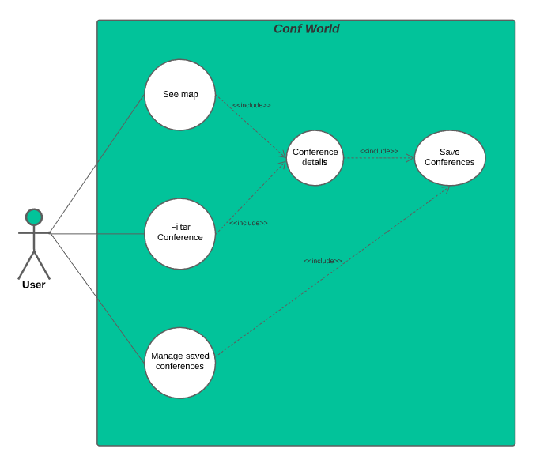
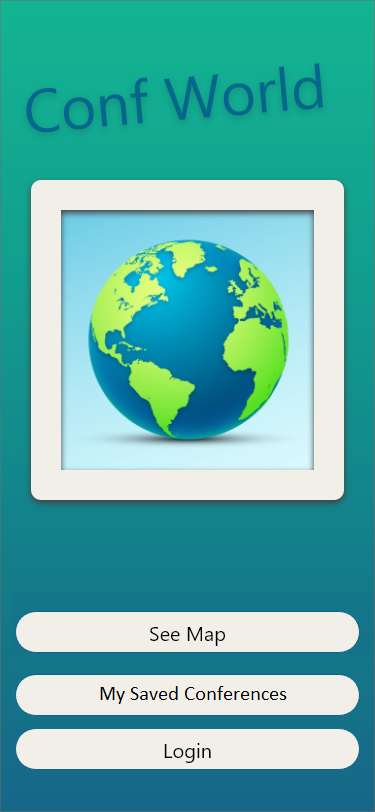
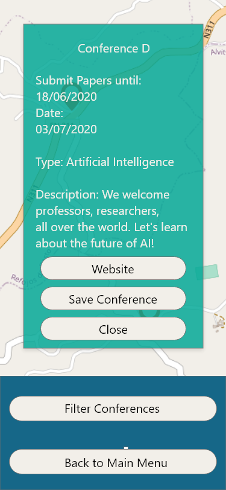

# Conf World

Welcome to the documentation pages of the *Conf World* of **openCX**!

* Business modeling 
  * [Product Vision](#Product-Vision)
  * [Elevator Pitch](#Elevator-Pitch)
* Requirements
  * [Use Case Diagram](#Use-case-diagram)
  * [User stories](#User-stories)
  * [Domain model](#Domain-model)
* Architecture and Design
  * [Logical architecture](#Logical-architecture)
  * [Physical architecture](#Physical-architecture)
  * [Prototype](#Prototype)
* [Implementation](#Implementation)
* [Test](#Test)
* [Configuration and change management](#Configuration-and-change-management)
* [Project management](#Project-management)

So far, contributions are exclusively made by the initial team, but we hope to open them to the community, in all areas and topics: requirements, technologies, development, experimentation, testing, etc.

Please contact us! 

Thank you!

*Bernardo António Magalhães Ferreira*
*Diogo Ferreira de Sousa*
*Diogo Samuel Gonçalves Fernandes*
*Hugo Miguel Monteiro Guimarães*

---

## Product Vision

Finding a conference to attend and all its relevant information can be difficult to do in a fast, easy way. Conf World allows you to find the conferences you want that fit right into your schedule.

---
## Elevator Pitch
Have you ever felt that most conference finding apps struggle at keeping up with your tight schedule? That is because they not only have a final *rendezvous* date, but also many paper submission deadlines. ***Conf World*** is a mobile app capable of filtering conferences based upon a time interval and conferences types, allowing the user to completely bypass this issue.

---
## Requirements

### Use Case Diagram 

#### Save Conference
* **Actor**. User

* **Description**. The user may be more interested in some conferences than others. Thus he is capable of saving conferences.

* **Preconditions and Postconditions**. After saving the conference, it will appear in the map with a yellow pinpoint.

* **Normal Flow**. 
    1. The user presses one conference on the map.
    2. The user presses the save conference button which appears next to the conference website hyperlink.
    3. The conference is saved.

#### See Map
* **Actor**. User

* **Description**. This use case exists so that the client can see where conferences are located.

* **Preconditions and Postconditions**. The client should press the Open Map button at the main menu. After pressing it, the app will show the global map with many pinpoints, each one representing one conference.

* **Normal Flow**. 
    1. The client presses the  *Open Map* button to open the world map.
    2. Now the user can search around the world for conferences
    3. When the user finds the desired conference (marked on the map with a pinpoint), the user can press it and view its information
    4. The user can click on the conference hyperlink to go to its website.  

#### Filter conference 
* **Actor**. User

* **Description**. The user can filter the conferences in order that only relevant ones appear. The user can filter them using the follow criteria.

* **Postconditions**. After using the filter, only certain conferences around the world will appear.

    ##### Conference Type

    * **Preconditions**. The user should press the button Filter by Type.

    * **Normal Flow**.
        1. The user selects the option that shows the conference types.
        2. On the map, the user will only see the conferences of that type.
            
    ##### Date

    * **Preconditions**. The user should press the button Filter by Date.
    
    * **Normal Flow**. 
        1. The user scrolls the sidebar, selecting the start and deadline date.
        1. The user selects the button Apply Date Filter.
        1. On the map, only conferences that occur between these two dates will appear. 
        
    ##### Saved Conferences

    * **Preconditions**. The user should press the button Saved Conferences.
    * **Normal Flow**.
        1. The user selects the option to only show the saved conferences.
        1. Only the saved conferences will appear on the map.


### User stories

#### User Story Map


#### Story 1

*As a user, I want to open up the map, so that I can see all the available conferences next to me.*

**User interface mockups**.
| Menu         | Map |
| ------------ | ---------- |
|  |  |

**Acceptance tests**.
```gherkin
Scenario:
  Given There is a View Map button
  When I tap the View Map button
  Then The world map will open
  And I will see all conferences represented by pinpoints
```

**Value and effort**.

*Value:* Must Have

*Effort:* L

*Effort Estimation History (from oldest to newest):* XL, L


#### Story 2

*As a user, I want to save a conference I wish to attend, so that I can mark it(save) on the map for easy access.*

**User interface mockups**.
| Save         |
| ------------ |
|  |

**Acceptance tests**.
```gherkin
Scenario:
  Given I have selected a conference on the map
  And I am Logged In
  When I tap the save conference button.
  Then The app will save my conference in the cloud
  And The conference pinpoint will have another color
```

```gherkin
Scenario:
  Given I have selected a conference on the map
  And I am Logged In
  When I tap the save conference button
  And the conference is already saved
  Then The conference will be removed from my saved conference list
  And The conference will appear with a regular color
```

```gherkin
Scenario:
  Given I have selected a conference on the map
  And I am not Logged In
  When I tap the save conference button
  Then The app will save my conference locally
  And The conference pinpoint will have another color
```

```gherkin
Scenario:
  Given I have selected a conference on the map
  And I am not Logged In
  When I tap the save conference button
  And the conference is already saved
  Then The conference will be removed from my saved conference list
  And The conference will appear with a regular color
```


**Value and effort**.

*Value:* Should Have

*Effort:* L

*Effort Estimation History (from oldest to newest):* M, L

#### Story 3

*As a user, I want to access a conference’s details, so that I can see the available information about it.*

**User interface mockups**.
| Conference Information |
| ---------------------- |
|  |

**Acceptance tests**.
```gherkin
Scenario:
  Given I have the conference pinpoint on my screen
  When I tap a conference's pinpoint
  Then I will be able to see all the information about it
```

```gherkin
Scenario:
  Given I have the conference pinpoint on my screen
  When I tap a conference's pinpoint
  And I press the conference website URL
  Then I will be redirected to the conference's website
  
```


**Value and effort**.

*Value:* Must Have

*Effort:* M

*Effort Estimation History (from oldest to newest):* M

#### Story 4

*As a user I want to select a timespan, so that I can see all available conferences in that timespan.*

**User interface mockups**.
| Filter Date  |
| ------------ |
|  |

**Acceptance tests**.
```gherkin
Scenario:
  Given I am in the Filter Conference Menu
  When I tap the Date button
  And Enter a timespan
  Then The app will show me all conferences that occurr within that timespawn
```

**Value and effort**.

*Value:* Must Have

*Effort:* L

*Effort Estimation History (from oldest to newest):* L

#### Story 5
*As a user, I want to search for conferences that match my interests, so that I can better find what I'm looking for.*

**User interface mockups**.
| Filter Conferences  | Filter by Type |
| ------------ | ---- |
|  |  |

**Acceptance tests**.
```gherkin
Scenario:
  Given I am on the Filtering Menu
  When I tap the Type button
  And I select a conference type
  Then The world map will only show pinpoints with conferences regarding the selected type
  And I will be able to select the conference
```

**Value and effort**.

*Value:* Must Have

*Effort:* L

*Effort Estimation History (from oldest to newest):* M, L

#### Story 6
*As a user, I want to view my previously saved conferences.*

**User interface mockups**.
| Main Menu | Filter Conferences  |
| ------------- | ------------ |
|  | |

**Acceptance tests**.
```gherkin
Scenario:
  Given I am on the Filtering Menu
  When I tap the Saved Conferences button
  And I am logged in
  Then The world map will only show pinpoints with saved conferences on the cloud
  And I will be able to view my saved conferences
```

```gherkin
Scenario:
  Given I am on the Filtering Menu
  When I tap the Saved Conferences button
  And I am not logged in
  Then The world map will only show pinpoints with saved conferences locally
  And I will be able to view my saved conferences
```

```gherkin
Scenario:
  Given I am on the Main Menu
  When I tap the Saved Conferences button
  And I am logged in
  Then It will appear a list with conferences saved on the cloud
```

```gherkin
Scenario:
  Given I am on the Main Menu
  When I tap the Saved Conferences button
  And I am not logged in
  Then It will appear a list with conferences saved locally
```

```gherkin
Scenario:
  Given I am on the Saved Conferences menu
  When I tap one conference
  Then I will be redirected to the conference details on the map
```


**Value and effort**.

*Value:* Should Have

*Effort:* L

*Effort Estimation History (from oldest to newest):* M, L

**Story #7**

*As a user, I want to log in, so that I can access my saved conferences.*

**User interface mockups**.
| Login  | Acess saved conferences without login |
| ------------ | ---- |
|  |  |


**Acceptance tests**.
```gherkin
Scenario:
  Given I am in the Main Menu
  And I am not Logged In yet.
  When I tap the Login button.
  And Enter my credentials correctly.
  And i press the submit button
  Then The app will log me into my account
```

```gherkin
Scenario:
  Given I am in the Main Menu
  And I am not Logged In yet.
  When I tap the Login button.
  And Enter my credentials incorrectly
  And I press the submit button
  Then The app will ask for my credentials again
```

```gherkin
Scenario:
  Given I am in the Main Menu
  And I have no account.
  When I tap the Login button.
  Then the app will ask for my new credentials.
  And i will be logged in.
```

**Value and effort**.

*Value:* Could Have

*Effort:* M

*Effort Estimation History (from oldest to newest):* M

### Domain model


The concepts regarding our application are quite simple. Our app consists of conferences spread around the World `Map` and the user has filtering tools at his disposal that allow him to find the most fitting conferences. Each `Conference` is represented on the world map by a `Marker`.

Once the user has opened the `Map`, it will render on a certain `latitude` and `longitude`, have some `Markers`, and each represents one `Conference`. 
Also, the user can just look for specific conferences. In this case, he will apply a `Filter` to the world map, but just one filter can be applied for the whole map at a time. The user can see the map without filters, seeing all the available conferences, or instead the user can filter by `Date`, by `Saved` conferences or by `Type`, but just one at a time.

---

## Architecture and Design

The architeture models of a big project can help newcomers to understand it better.
### Logical architecture


In order to develop this project, we decided to organize and structure our code using the MVC. The code is divided into three different packages: 


* Controller
* View
* Model


The Controller processes the received information from user actions. These actions trigger changes both in the view (for example, changing the current screen displayed) and in the model (for example, when the user saves a conference).

Our View is responsible for the concrete display of the app to the user. It renders our widgets and different pages, like the homepage on the smartphone screen.

The Model contains all the application data. It represents stored entities managed by the controller. In our case, it represents the conferences.


### Physical architecture


Our project's physical structure is very simple and relies in only one block. 
Since all of the app information is stored in a local database, our app will only execute queries to select, update and insert conferences on the SQLite database.
We decided to use a local storage instead of a cloud storage because the lost data caused by changing devices is not significant. If the user changes their device, losing the saved conferences would not matter too much.

We chose to use SQLite database due to its simplicity and the good integration with flutter. 


---

### Prototype

We decided to use the more relevant user stories to create our aplication prototype. 


---

## Implementation

### Sprint Reviews
#### First Sprint

##### User Story 1
*As a user, I want to open up the map, so that I can see all the available conferences next to me.*
* Added Main Menu
* Added World Map
* Added pinpoints in World Map with conferences. This functionality is currently hard coded.

Sprint Effort: L

#### Second Sprint

##### User Story 3
*As a user, I want to access a conference’s details, so that I can see the available information about it.*
* When user presses one conference, the user can see the information about it.
* There is a link that redirects the user to the webpage.
##### User Story 5

*As a user, I want to search for conferences that match my interests, so that I can better find what I'm looking for.*
* When a user goes to the filtering menu, he can filter by type.
* After choosing the filtered conference type, only conferences of that ype will appear on map.
##### Miscellaneous
* Conferences are now read from a JSON file.

Sprint Effort: L

#### Third Sprint

##### User Story 2
*As a user, I want to save a conference I wish to attend, so that I can mark it(save) on the map for easy access.*
* When user presses one conference, the user can save the conference to favorites.
* The conference will now appear yellow on world map.

##### User Story 6
*As a user, I want to view my previously saved conferences.*
* When a user goes to the filtering menu, he can filter by saved conferences.
* The user now have a list with all conferences saved.

##### Miscellaneous
* Now, when user presses the go back button he is always redirected to the main menu.
* Changed colors of the app!
* Now things are stored in a local database using SQLite.

Sprint Effort: L

#### Fourth Sprint
##### User Story 4
##### As a user I want to select a timespan, so that I can see all available conferences in that timespan.
* The user can select a timespan to search for conferences.

##### Miscellaneous
- Conferences are scrapped from the webpage [Call 4 Papers](www.call4papers.com)
- Implemented Gherkin Acceptance Tests
- Finished Unit Tests
- Changed the theme and created a logo for the app

Sprint Effort: L

---
## Test

To ensure the application is working properly, we have decided to add unit tests and automated acceptance tests using gherkin.

We used the github issues to organize our project. If you want to see our implementation of user stories you can click [here](https://github.com/FEUP-ESOF-2020-21/open-cx-t2g1-2b-2b/issues?q=is%3Aissue+is%3Aclosed) and choose the label `User Stories` to see the issues that map for every user story.

Unit Tests are used to verify the expected output after the user interacts with the application and have been implemented using the `flutter_test` dependency.

Acceptance Tests are used to verify the expected output through statements that we implemented as *user stories* that describe all of the actions the user must take to permform a task, and the result of those actions. These tests were implemented using *Gherkin* language, through the `flutter_gherkin` dependency.

Both these tests involve a large ammount of work, however, they provide a long-term benefit to the project, making it easier to detect bugs in the future.

Implemented acceptance tests and their respective user story:
  - Conference Details - [User Story 3](https://github.com/FEUP-ESOF-2020-21/open-cx-t2g1-2b-2b/issues/4)
  - Filter Conferences By Type - [User Story 5](https://github.com/FEUP-ESOF-2020-21/open-cx-t2g1-2b-2b/issues/5)
  - Open World Map - [User Story 1](https://github.com/FEUP-ESOF-2020-21/open-cx-t2g1-2b-2b/issues/1)

This acceptance tests where implemented in this [pull request](https://github.com/FEUP-ESOF-2020-21/open-cx-t2g1-2b-2b/pull/35).

Implemented Unit Tests:
  - See World Map 
  - See Saved Conferences
  - Filter Conferences Button
  - Filter Conferences by Type
  - Filter Conferences by Date
  - Filter Conferences by Saved Conferences
  - See World Map Without Filters
  - Default Navigation State
  - Navigation between States 
  - Switching to Filter Conferences State
  - Switching to Filter Conferences State and back to Home

This unit tests where implemented in this [pull request](https://github.com/FEUP-ESOF-2020-21/open-cx-t2g1-2b-2b/pull/40).

There are still many tests that can be tested in the future. The planned features to be tested are the following:

- Saved Conferences local database persistent data storage.
- Pressing a Conference in Saved Conferences Menu redirects to the world map with the chosen conference centered.

We're actually running this tests automatically on [github actions](https://github.com/FEUP-ESOF-2020-21/open-cx-t2g1-2b-2b/actions). However the pipeline running the gherkin acceptance tests are not running because they need an emulator to have a successfully run.

---
## Configuration and change management

Configuration and change management are key activities to control change to, and maintain the integrity of, a project’s artifacts (code, models, documents).

For the purpose of ESOF, we will use a very simple approach, just to manage feature requests, bug fixes, and improvements, using GitHub issues and following the [GitHub flow](https://guides.github.com/introduction/flow/).

Also we configured a workflow using github actions to automatically run our unit tests and to build the apk.

---

## Project management

Software project management is an art and science of planning and leading software projects, in which software projects are planned, implemented, monitored and controlled.

For this project, we are using Github Projects. You can see our board using the following link:
  * [Github Projects](https://github.com/FEUP-ESOF-2020-21/open-cx-t2g1-2b-2b/projects/1)

  
---

## Evolution - Contributions to open-cx

We feel that our app can integrate the Open-CX in the future, helping everyone finding conferences around the world that can fit in their schedules, combining it with other projects.
